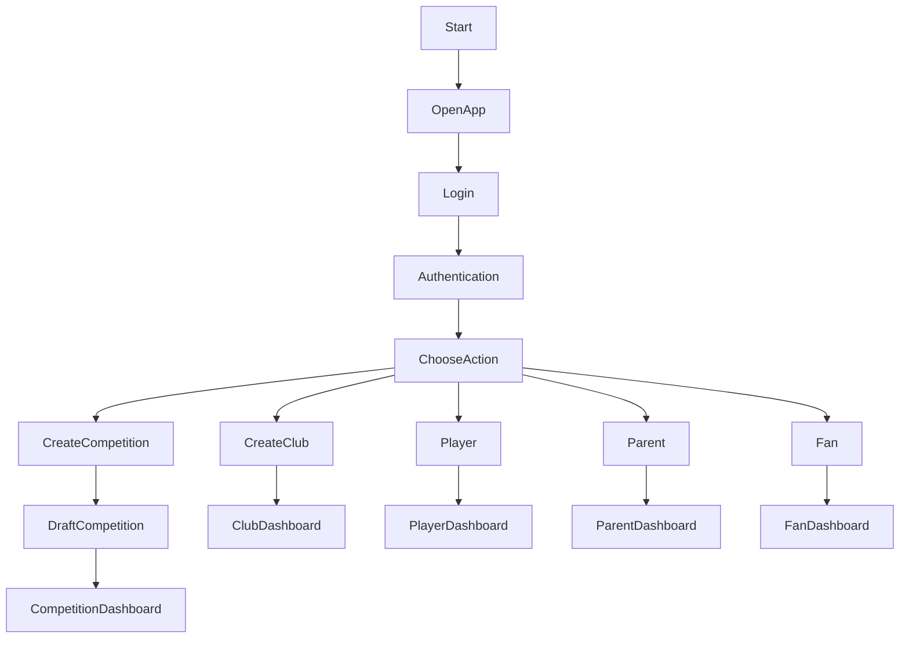

# Football Platform

Global football platform for clubs, competitions, players, parents and fans.

The goal is to create a simple and scalable football ecosystem where anyone can:

- create leagues and tournaments
- manage clubs and teams
- register players
- follow matches and statistics
- build football communities

---

# Core Principle

Ask as little information as possible during setup.

Most settings are configured later inside the dashboard.

---

# User Entry Workflow

---

# Project Structure

football-platform
│
├─ docs
├─ diagrams
├─ product
├─ app
└─ backend

---

# Documentation

Main documents:

- Vision
- Roles and Permissions
- Competition Creation
- Player Registration
- Technical Architecture

See /docs folder.

---

# Roadmap

Phase 1  
Concept and architecture

Phase 2  
MVP development

Phase 3  
Pilot countries

Phase 4  
Global launch
